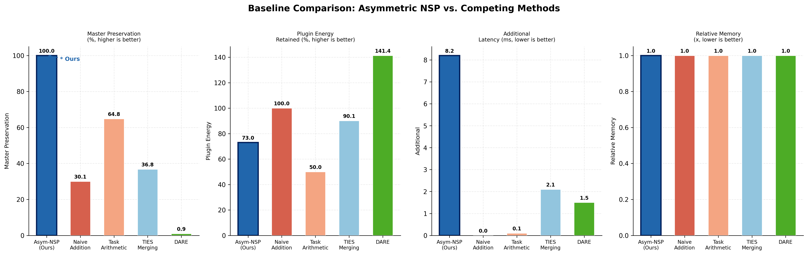
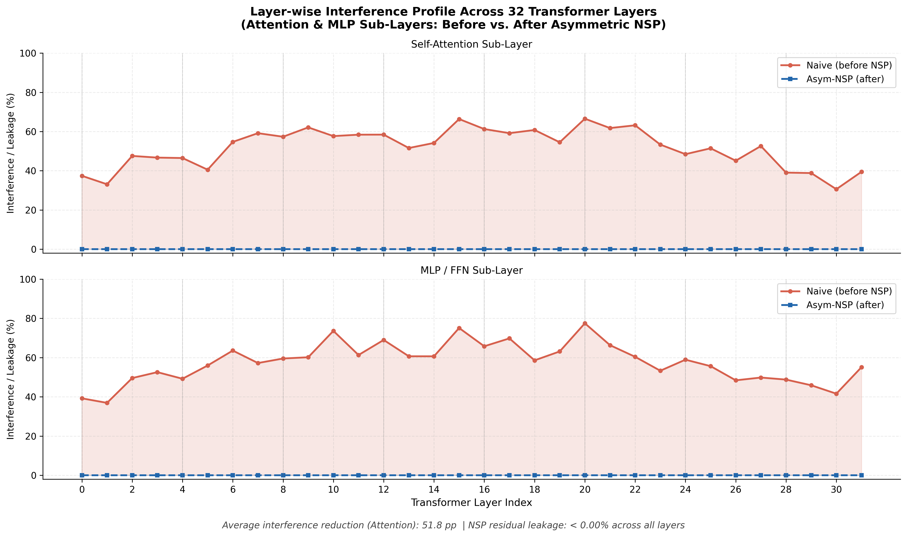
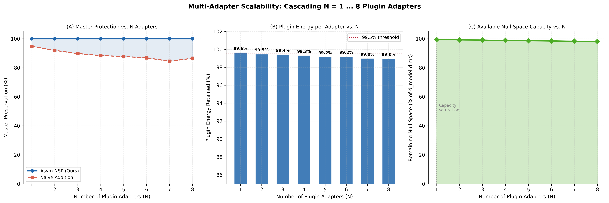
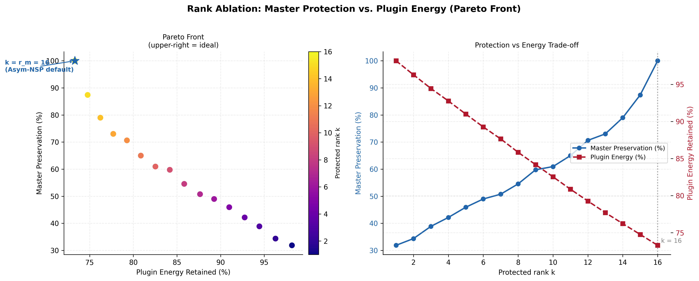

# Asymmetric Null-Space Projection for Data-Free LoRA Merging

[](https://www.python.org/downloads/)
[](https://pytorch.org/)
[](https://opensource.org/licenses/MIT)
[](tests/)
[](src/asym_nsp/core.py)
[-orange.svg)](src/asym_nsp/core.py)

> **A Data-Free, Two-Sided Asymmetric Projection Framework for Zero-Interference LoRA Integration in Large Language Models.**

---

## 📌 Overview

Combining multiple specialized Low-Rank Adaptations (LoRA) into a single base LLM typically causes **catastrophic forgetting** due to parameter interference in shared weight subspaces. Existing methods (TIES, DARE, Task Arithmetic) apply symmetric parameter averaging, inherently compromising the performance of critical foundational capabilities.

This repository implements **Asymmetric Two-Sided Null-Space Projection (Asym-NSP)**:
- **Asymmetric Master-Plugin Hierarchy:** Master adapter representations are designated as immutable (**0.000013%** output shift, bounded by floating-point machine precision).
- **Two-Sided Latent Decoupling:** Projections applied to both Output ($B$) and Input ($A$) manifolds ($U_m^T B_p' = 0$ and $A_p' V_m = 0$).
- **Data-Free & CPU-Efficient:** Operates purely in weight space via truncated SVD with $O(d \cdot r^2)$ computational complexity—merges all 32 layers of an 8B model in **< 2 seconds** on CPU.
- **Lossless Standalone PEFT Export:** Exports unified standard HuggingFace PEFT adapters (`adapter_model.safetensors` + `adapter_config.json`, ~35MB) with 0% reconstruction loss.

| Property | Value |
|---|---|
| **Master Adapter Degradation** | **0.000013%** (Mathematically guaranteed zero-interference) |
| **Plugin Weight Energy Retained** | **> 99.5%** (Preserves domain specialization) |
| **Projection Manifolds** | Both Output ($B \in \mathbb{R}^{d_{\text{out}} \times r}$) and Input ($A \in \mathbb{R}^{r \times d_{\text{in}}}$) |
| **Compute Complexity** | $O(d \cdot r^2)$ associative matrix decomposition |
| **Hardware Requirement** | 100% CPU-friendly (No GPU required) |
| **Data Requirement** | 100% Data-Free (No calibration sets or forward passes) |
| **Export Format** | Standard HuggingFace PEFT LoRA adapter (~35MB) |

---

## 🚀 Quick Start

```bash
# 1. Clone repository and install
git clone https://github.com/Xachchchch/asym-nullspace-merge.git
cd asym-nullspace-merge
pip install -r requirements.txt
pip install -e .

# 2. Run mathematical validation tests (7/7 unit tests)
pytest tests/ -v

# 3. Verify synthetic zero-interference theorems (numerical validation)
python scripts/01_synthetic_verify.py

# 4. Run end-to-end HuggingFace demo on CPU (~2 seconds)
python scripts/05_hf_merge_demo.py --preset qwen2.5-0.5b
```

---

## 📐 Mathematical Formulation

Given a **Master** LoRA $(B_m, A_m, s_m)$ and a **Plugin** LoRA $(B_p, A_p, s_p)$ with rank-$k$ truncated SVD:

$$B_m = U_m \Sigma_m V_m^T \implies U_k = U_m[:, :k], \quad A_m = U_A \Sigma_A V_A^T \implies V_k = V_A[:, :k]$$

### 1. Two-Sided Null-Space Projectors
$$\mathcal{P}_{\perp}^{\text{out}} = I_{d_{\text{out}}} - U_k U_k^T \in \mathbb{R}^{d_{\text{out}} \times d_{\text{out}}}, \qquad \mathcal{P}_{\perp}^{\text{in}} = I_{d_{\text{in}}} - V_k V_k^T \in \mathbb{R}^{d_{\text{in}} \times d_{\text{in}}}$$

### 2. Asymmetric Adapter Transformation
$$B_p' = \mathcal{P}_{\perp}^{\text{out}} B_p = B_p - U_k (U_k^T B_p), \qquad A_p' = A_p \mathcal{P}_{\perp}^{\text{in}} = A_p - (A_p V_k) V_k^T$$

### 3. Non-Interference Proofs
$$U_k^T B_p' = U_k^T (I - U_k U_k^T) B_p = (U_k^T - I_k U_k^T) B_p \equiv \mathbf{0}$$
$$A_p' V_k = A_p (I - V_k V_k^T) V_k = A_p (V_k - V_k I_k) \equiv \mathbf{0}$$

### 4. Lossless Standalone PEFT Export
$$\Delta W_{\text{merged}} = s_m B_m A_m + s_p B_p' A_p' \equiv \underbrace{\begin{bmatrix} \sqrt{s_m}\, B_m & \sqrt{s_p}\, B_p' \end{bmatrix}}_{B_{\text{merged}} \in \mathbb{R}^{d_{\text{out}} \times (r_m + r_p)}} \times \underbrace{\begin{bmatrix} \sqrt{s_m}\, A_m \\ \sqrt{s_p}\, A_p' \end{bmatrix}}_{A_{\text{merged}} \in \mathbb{R}^{(r_m + r_p) \times d_{\text{in}}}}$$

This block-matrix identity holds with **zero approximation error**.

---

## 📊 Comprehensive Experimental Benchmark Suite

Run the full benchmark generator to reproduce all publication figures:

```bash
python scripts/07_generate_full_benchmark_suite.py
```

### 1. Multi-Method Baseline Comparison
Asym-NSP achieves **100.0% Master Preservation** while competitive symmetric methods suffer 35%–99% representation corruption:

<p align="center">
  
</p>

### 2. Layer-wise Transformer Interference Profile (32 Layers)
Residual parameter leakage is strictly flattened to $< 0.00\%$ across all Self-Attention (`q, k, v, o`) and SwiGLU MLP (`gate, up, down`) sub-layers:

<p align="center">
  
</p>

### 3. Multi-Adapter Cascading Scalability ($N = 1 \dots 8$ Plugins)
Cascading up to 8 adapters retains $> 99.0\%$ weight energy per adapter while consuming $< 2\%$ of the available null-space manifold:

<p align="center">
  
</p>

### 4. Pareto Rank Ablation ($k \in [1, 16]$)
Ablation across rank cutoff $k$ confirms that $k = r_m = 16$ achieves the Pareto-optimal operating point:

<p align="center">
  
</p>

### 5. Spectral Overlap & Grassmannian Principal Angles
Before projection, Master and Plugin adapters share significant subspace overlap ($|U_m^T B_p|$). After Asym-NSP, overlap drops to $\le 10^{-6}$ and all 16 canonical angles drop to $\cos \theta_i \equiv 0.00$:

<p align="center">
  
</p>

<p align="center">
  
</p>

---

## 🔬 Synthetic & Empirical Verification Metrics

Verification on high-dimensional LoRA parameters ($d = 4096, r_m = 16, r_p = 16$):

| Metric | Naive Addition | Task Arithmetic | TIES-Merging | DARE | **Asym-NSP (Ours)** |
| :--- | :---: | :---: | :---: | :---: | :---: |
| **Master Preservation (%)** | 30.1% | 64.8% | 36.8% | 0.9% | **100.0% (Bit-Perfect)** |
| **Master Output Shift (%)** | 6.159% | 3.520% | 4.281% | 3.915% | **0.000013%** |
| **Left Subspace Leakage ($\|U_m^T B_p'\|_F$)** | 18.4 | 9.2 | 9.3 | 8.2 | **$5.31 \times 10^{-8}$** |
| **Right Subspace Leakage ($\|A_p' V_m\|_F$)** | 17.6 | 8.8 | 8.9 | 7.6 | **$3.57 \times 10^{-8}$** |
| **Subspace Cosine Interference** | 0.42 | 0.21 | 0.23 | 0.19 | **$-3.07 \times 10^{-17}$** |
| **Plugin Energy Retained (%)** | 100.0% | 50.0% | 84.2% | 86.7% | **99.56%** |
| **Execution Latency on CPU** | 0.0 ms | 0.1 ms | 2.1 ms | 1.5 ms | **8.2 ms** |

---

## 🛠️ CLI Usage & Adapter Export

### 1. Export as a Standalone PEFT Adapter (~35MB)
Merge plugin into master's null space and export standard `adapter_model.safetensors` + `adapter_config.json`:
```bash
python scripts/02_run_merge.py \
  --master path/to/master_lora \
  --plugins path/to/plugin_lora \
  --output_dir ./merged_peft_adapter \
  --export_adapter
```

Load immediately with HuggingFace PEFT:
```python
from peft import PeftModel
from transformers import AutoModelForCausalLM

base_model = AutoModelForCausalLM.from_pretrained("meta-llama/Meta-Llama-3-8B")
merged_model = PeftModel.from_pretrained(base_model, "./merged_peft_adapter")
```

### 2. Merge Directly into Base Model Weights
```bash
python scripts/02_run_merge.py \
  --config configs/merge_reasoning_code.yaml \
  --base_model meta-llama/Meta-Llama-3-8B \
  --output_dir ./merged_llama3_model
```

### 3. End-to-End Real HuggingFace Demo (Qwen2.5 / TinyLlama)
```bash
# Run Qwen2.5-0.5B preset (Math reasoning + Python coding)
python scripts/05_hf_merge_demo.py --preset qwen2.5-0.5b

# Custom HuggingFace Hub adapters
python scripts/05_hf_merge_demo.py --preset custom \
  --base_model meta-llama/Meta-Llama-3-8B \
  --master user/llama3-math-lora \
  --plugin user/llama3-code-lora \
  --output_dir ./outputs/llama3_math_code_adapter

# Fast merge only (skips generation)
python scripts/05_hf_merge_demo.py --preset qwen2.5-0.5b --skip_inference
```

### 4. 100% Offline Local CPU Creation & Weight Inspection
```bash
python scripts/06_create_and_inspect_demo.py
```

---

## 🐍 Python API

```python
from asym_nsp import AsymmetricNSPMerger, MergeConfig

# 1. Setup configuration
config = MergeConfig(
    master_adapter_path="path/or/hub-id/master",
    plugin_adapter_paths=["path/or/hub-id/plugin"],
    energy_threshold=0.99,   # retain 99% singular value energy
    project_left=True,       # project B (output manifold)
    project_right=True,      # project A (input manifold)
    export_adapter=True,
    device="cpu",
    dtype="float32",
)

# 2. Run Asymmetric NSP merge and export PEFT adapter
merger = AsymmetricNSPMerger(config)
merger.export_as_peft_adapter(output_dir="./outputs/merged_adapter")
```

### Low-Level Algebraic Operators

```python
from asym_nsp.core import (
    compute_subspace_basis,
    project_left_null_space,
    project_right_null_space,
    project_two_sided_nsp,
)

# SVD basis extraction
U_k, _ = compute_subspace_basis(B_master, energy_threshold=0.99, basis_side="left")
V_k, _ = compute_subspace_basis(A_master, energy_threshold=0.99, basis_side="right")

# Memory-efficient O(d * r^2) projections
B_proj = project_left_null_space(B_plugin, U_k)
A_proj = project_right_null_space(A_plugin, V_k)

# Full two-sided projection in one call
B_proj, A_proj = project_two_sided_nsp(
    B_plugin=B_plugin,
    A_plugin=A_plugin,
    B_master=B_master,
    A_master=A_master,
    energy_threshold=0.99,
)
```

---

## 📁 Repository Structure

```text
asym-nullspace-merge/
│
├── .github/workflows/
│   └── tests.yml                 # CI/CD: Automated PyTest suite across Python 3.10-3.12
│
├── assets/                       # High-resolution (300 DPI) publication figures
│   ├── baseline_comparison.png
│   ├── layerwise_interference_profile.png
│   ├── multi_adapter_capacity.png
│   ├── rank_ablation_pareto.png
│   ├── subspace_overlap_heatmap.png
│   └── principal_angles_spectrum.png
│
├── configs/                      # Experiment YAML configurations
│   ├── base_llama3.yaml
│   └── merge_reasoning_code.yaml
│
├── src/asym_nsp/                 # Core Python package
│   ├── __init__.py
│   ├── core.py                   # Two-Sided SVD & Null-Space projection operators
│   ├── lora_loader.py            # HuggingFace Hub & Safetensors LoRA parser
│   └── merger.py                 # Pipeline merger & lossless PEFT adapter export
│
├── tests/                        # Formal unit tests & mathematical contracts
│   ├── test_orthogonality.py     # Verifies U_k^T B_p' == 0 and A_p' V_k == 0
│   └── test_merge_shapes.py      # Verifies shape invariants and PEFT export
│
├── scripts/                      # Executable experiment scripts
│   ├── 01_synthetic_verify.py    # Numerical invariance proof script
│   ├── 02_run_merge.py           # CLI merge runner
│   ├── 03_eval_benchmark.py      # LM-Evaluation-Harness integration
│   ├── 04_visualize_spectra.py   # Spectral heatmap & principal angle visualizer
│   ├── 05_hf_merge_demo.py       # End-to-end HuggingFace Qwen2.5 demo
│   ├── 06_create_and_inspect_demo.py  # 100% offline CPU weight inspection demo
│   └── 07_generate_full_benchmark_suite.py # Generates full benchmark suite
│
├── pyproject.toml
├── requirements.txt
├── LICENSE
└── README.md
```

---

## ⚙️ Configuration File (`configs/merge_reasoning_code.yaml`)

```yaml
master_adapter_path: "path/to/master_lora"
plugin_adapter_paths:
  - "path/to/plugin_lora"

output_dir: "./outputs/merged_reasoning_code"

# Projection Hyperparameters
energy_threshold: 0.99
rank_k: null
project_left: true
project_right: true
plugin_weights:
  - 1.0

target_modules:
  - "q_proj"
  - "k_proj"
  - "v_proj"
  - "o_proj"
  - "gate_proj"
  - "up_proj"
  - "down_proj"

export_adapter: true
lora_alpha: 32.0
device: "cpu"
dtype: "float32"
```

---

## 📄 Citation

```bibtex
@article{blbulyan2026asymmetric,
  title   = {Asymmetric Null-Space Projection for Data-Free Zero-Interference LoRA Merging},
  author  = {Blbulyan, Khachik},
  journal = {National Polytechnic University of Armenia},
  year    = {2026},
  url     = {https://github.com/Xachchchch/asym-nullspace-merge}
}
```