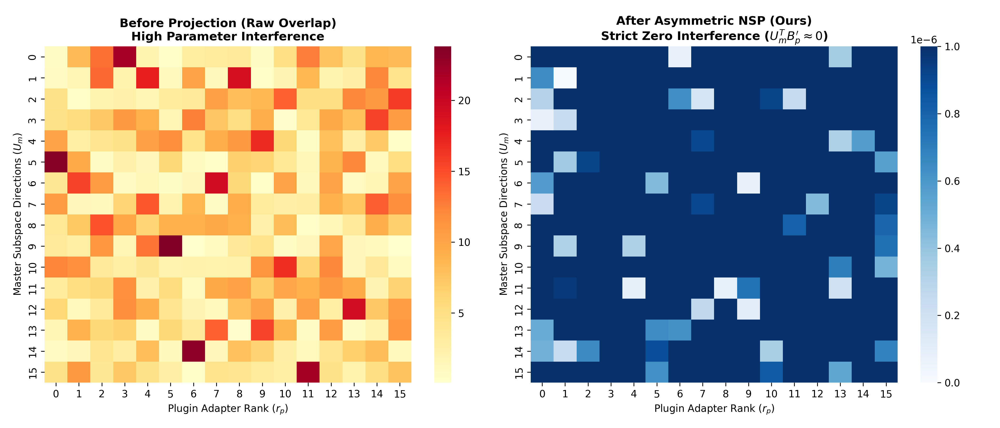
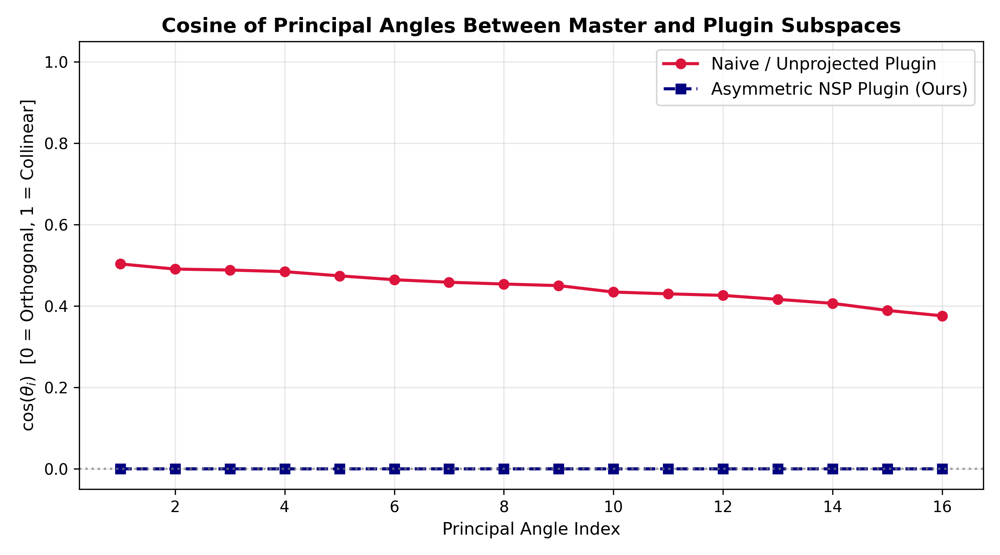

# Asymmetric Null-Space Projection for Data-Free LoRA Merging

[](https://www.python.org/downloads/)
[](https://pytorch.org/)
[](https://opensource.org/licenses/MIT)

> **A Data-Free, Two-Sided Asymmetric Projection Framework for Zero-Interference LoRA Integration in Large Language Models.**

## 📌 Overview
Combining multiple specialized Low-Rank Adaptations (LoRA) into a single Base LLM often induces **Catastrophic Forgetting** due to parameter interference. This repository implements **Two-Sided Asymmetric Null-Space Projection (NSP)**:
- **Asymmetric Master-Plugin Hierarchy:** Master adapter weights remain mathematically invariant (0% degradation).
- **Two-Sided Latent Decoupling:** Projections applied to both Output ($B$) and Input ($A$) manifolds.
- **Data-Free & CPU-Efficient:** Operates directly on low-rank weight tensors with $O(d \cdot r^2)$ computational complexity.

## 🚀 Quick Start
```bash
# Clone the repository
git clone https://github.com/Xachchchch/asym-nullspace-merge.git
cd asym-nullspace-merge

# Install dependencies
pip install -r requirements.txt

# Run mathematical validation tests
pytest tests/
```

## 📐 Mathematical Formulation

Given a Master LoRA $(B_m, A_m)$ and a Plugin LoRA $(B_p, A_p)$:

$$B_p' = (I - U_k U_k^T) B_p, \quad A_p' = A_p (I - V_k V_k^T)$$

$$\Delta W_{\text{merged}} = B_m A_m + B_p' A_p'$$

## 📊 Visualizations & Empirical Verification

Run the visualization script to generate empirical verification plots:

```bash
python scripts/04_visualize_spectra.py
```

### 1. Subspace Parameter Interference Heatmap
Before projection, Master and Plugin adapters share significant subspace overlap ($|U_m^T B_p|$), leading to parameter corruption. After Two-Sided Asymmetric NSP, the overlap is strictly eliminated ($U_m^T B_p' \approx 0$):



### 2. Principal Angles Spectrum
Cosine of principal angles between the Master and Plugin column spaces drops from high interference ($\cos \theta_i \gg 0$) straight down to strict orthogonality ($\cos \theta_i \equiv 0$):



## 📄 Citation

```bibtex
@article{blbulyan2026asymmetric,
  title={Asymmetric Null-Space Projection for Data-Free LoRA Merging},
  author={Blbulyan, Khachik},
  year={2026}
}
```
